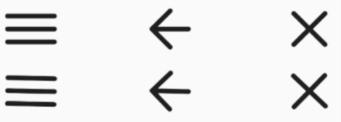

# Navigation toggle icon

[Compose Multiplatform](https://www.jetbrains.com/lp/compose-multiplatform/) icon which have 3 states (burger, arrow and cross) and animated transitions between them

[](https://www.apache.org/licenses/LICENSE-2.0)
[](https://central.sonatype.com/artifact/ru.ztrap/navigation-toggle-icon)

Supported platforms:


## Install

```gradle
implementation 'ru.ztrap:navigation-toggle-icon:${latestVersion}'
```

## Sample



## Usage

1. Simple toggle icon

    ```kotlin
    var toggled by remember { mutableStateOf(false) }
    
    NavigationToggleIcon(
        modifier = Modifier.size(24.dp).clickable { toggled = !toggled },
        startIconType = Burger,
        endIconType = Arrow,
        toggled = toggled,
        contentDescription = null,
    )
    ```

2. Toggle icon with controlled progress

    ```kotlin
    val progress = // any source which produce progress in 0f..1f bounds
    
    NavigationToggleIcon(
        modifier = Modifier.size(24.dp),
        startIconType = Burger,
        endIconType = Arrow,
        progress = progress,
        contentDescription = null,
    )
    ```

## Developed By

- Peter Gulko
- ztrap.developer@gmail.com

## License

```
Copyright 2024 Peter Gulko (zTrap)

Licensed under the Apache License, Version 2.0 (the "License");
you may not use this file except in compliance with the License.
You may obtain a copy of the License at

   https://www.apache.org/licenses/LICENSE-2.0

Unless required by applicable law or agreed to in writing, software
distributed under the License is distributed on an "AS IS" BASIS,
WITHOUT WARRANTIES OR CONDITIONS OF ANY KIND, either express or implied.
See the License for the specific language governing permissions and
limitations under the License.
```
